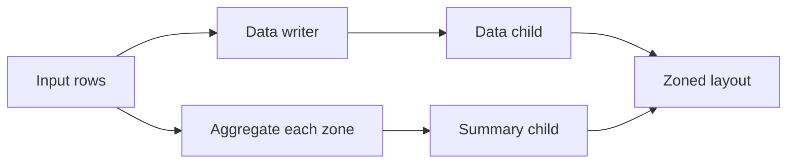

# How skip indexes work in Vortex

[Research landing page](../../README.md)

Vortex stores columns as arrays and organizes file data through composable layouts. A layout
describes how to read or write part of a file. Layouts can contain other layouts. For example, a
list layout separates list offsets from element data.

## What an index proves

A skip index summarizes a group of rows, called a **zone**. It can prove that no row in a zone
satisfies a query predicate. It does not identify every matching row.

For example, a zone with values between 10 and 20 cannot match `value = 30`. A Bloom filter can also
prove that a value is absent. A positive Bloom probe means only that the value is possibly present.
The reader still evaluates the query on retained rows.

Keeping an unnecessary zone costs work but preserves the result. Skipping a zone with a matching row
is a correctness bug. The research calls the first case a **pruning-quality** issue.

## The pieces of the API

| Term | Meaning in this research |
| --- | --- |
| `DType` | The logical type of an array, including nullability and nested fields. |
| Aggregate | A function that summarizes many input values, such as Min, Max, or a Bloom filter builder. |
| Partial state | The intermediate aggregate representation. It can be combined with another compatible partial. |
| Final result | The user-visible result of an aggregate. It can differ from its partial state. |
| Bound aggregate | An aggregate implementation with concrete configuration, represented by `AggregateFnRef`. |
| Vtable or plugin | The implementation registered under an aggregate or scalar-function identifier. |
| Session | The object that holds registries needed to construct and read functions and layouts. |
| Scalar function | A function used in expressions, such as equality or a Bloom membership probe. |
| Rewrite rule | A rule that turns a query predicate into a proof over stored summaries. |
| Binder | The component that replaces abstract summary references with expressions over physical storage. |

A partial can be a structure. For example, a mean can keep a sum and a count before finalization.
Several summary components can therefore belong to one aggregate. One aggregate per index does not
restrict its state to one scalar value.

## The write and read paths

`SkipIndex` groups the components needed for an index. Its bound aggregate carries the persisted
identifier and configuration. `SkipIndex` does not need a separate file-format identity.

The write path computes one partial per zone and stores it beside the data. `ZonedLayout` contains a
data child and an auxiliary summary child. A zone map interprets the summary columns.

`RepartitionStrategy` divides the input stream into chunks with the required zone length.
`TableStrategy` chooses layouts for nested fields, lists, and scalar columns. Their composition
determines whether a field-specific index preserves the normal structure of the data.

The read path uses registered plugins to interpret persisted aggregates. Rewrite rules construct
proofs over abstract statistics. The zone-map binder connects those statistics to stored partials.
The reader skips zones where the proof establishes that the query cannot match.

`StatFn` refers to the aggregate's partial state. It does not automatically finalize the aggregate.
This contract lets a rewrite inspect individual fields of a structured summary.

The **root input** is the array summarized by the current zone map. It is not necessarily the whole
table. A nested field can have its own zone map and root input. A summary of that array does not
automatically describe a derived expression, such as a cast or arithmetic operation on it.

## Where the code lives

| Crate | Responsibility | Entry point |
| --- | --- | --- |
| `vortex-array` | Aggregate functions, expressions, and rewrite rules | [Aggregate trait](../../vortex-array/src/aggregate_fn/vtable.rs), [rewrite context](../../vortex-array/src/stats/rewrite.rs) |
| `vortex-layout` | Structural layouts, zoned summaries, and skip-index components | [Table strategy](../../vortex-layout/src/layouts/table.rs), [SkipIndex](../../vortex-layout/src/layouts/zoned/skip_index/mod.rs) |
| `vortex-file` | The file API and its writer builder | [WriteStrategyBuilder](../../vortex-file/src/strategy.rs) |

These links show the prototype on this branch. Each finding compares it with the fixed PR snapshot
linked from the landing page.

## How to interpret the evidence

**Reproduced failure** means that a focused test demonstrated the behavior. **Source finding** means
that the contract follows from code inspection without a full failing query. **Design alternative**
means that the option was evaluated but not implemented.

Some tests construct a layout reader directly to exclude file-level statistics. Otherwise, an
independent file statistic can hide the loss of pruning inside a zone map.
